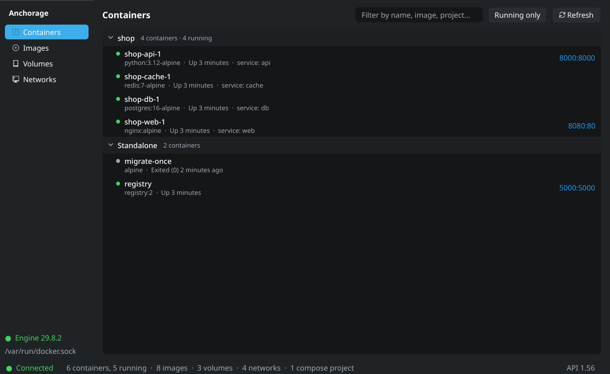
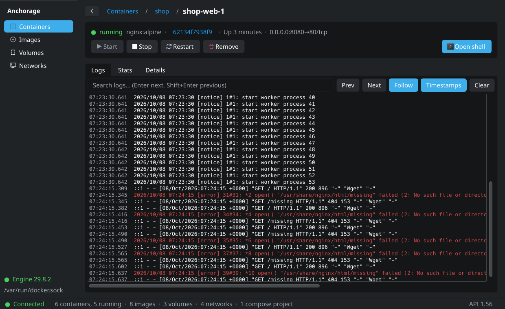
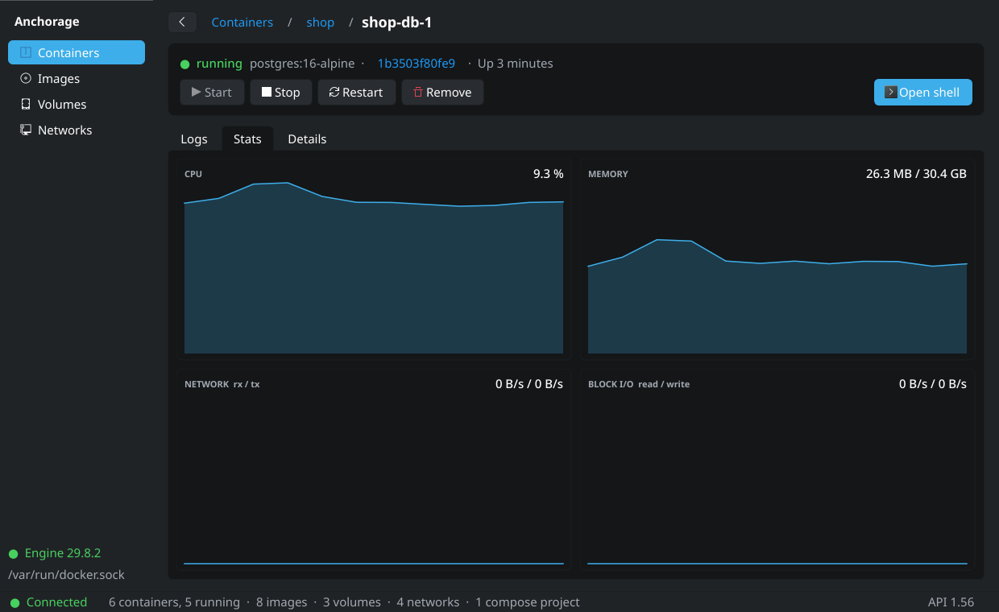
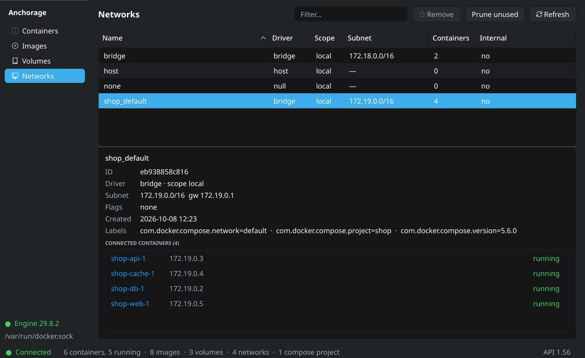
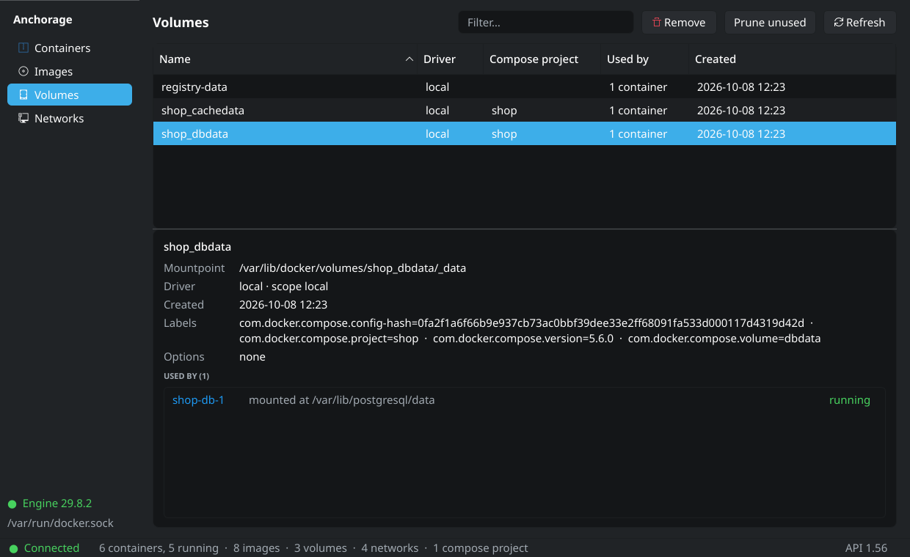

# Anchorage

[English](README.md) | **Русский**

Нативный Linux-клиент для Docker Engine. Работает с демоном напрямую через UNIX-сокет и
представляет собой обычное Qt-приложение, которое следует теме рабочего стола. Виртуальной
машины и веб-вью нет.

| | |
|---|---|
|  |  |
|  |  |

## Возможности

- Контейнеры, сгруппированные по проектам Compose, с живым состоянием; запуск, остановка,
  перезапуск, удаление.
- Логи контейнера с поиском и слежением, графики CPU / памяти / сети / блочного ввода-вывода
  и полное дерево inspect.
- «Open shell» запускает `docker exec -it` в вашем эмуляторе терминала.
- Образы с прогрессом загрузки, удалением и очисткой.
- Тома и сети вместе с контейнерами, которые их используют.
- Автоматическое переподключение после перезапуска демона.

## Требования

- Linux с графической сессией (X11 или Wayland).
- Docker Engine 20.10 или новее (API 1.41), доступный через UNIX-сокет, и право им
  пользоваться (обычно членство в группе `docker`).
- Python 3.11 или новее и PySide6 6.6 или новее (ставятся пакетом).
- Для «Open shell»: утилита `docker` и эмулятор терминала (`xdg-terminal-exec` или один из
  распространённых: konsole, gnome-terminal, kitty, alacritty, foot, xfce4-terminal).

## Установка

Пакеты для каждого выпуска приложены к
[релизам на GitHub](https://github.com/zexuzzzz/anchorage/releases).

| Дистрибутив | Пакет |
|---|---|
| Любой x86_64 Linux с glibc 2.28 или новее (Debian 11+, Ubuntu 20.04+, RHEL/Rocky/Alma 8+, openSUSE Leap, любой Fedora) | `anchorage_<version>-1~universal_amd64.deb` (`sudo apt install ./anchorage_*universal_amd64.deb`), `anchorage-<version>-1~universal.x86_64.rpm` (`sudo dnf install ./anchorage-*universal.x86_64.rpm` или `zypper in`) либо `Anchorage-<version>-x86_64.AppImage` (`chmod +x`, затем запуск; без FUSE добавьте `--appimage-extract-and-run`). Самодостаточный: собственные Python и Qt в `/opt/anchorage`, около 46 МБ (deb), 41 МБ (rpm) или 61 МБ (AppImage) для загрузки и около 180 МБ после установки. Системы с glibc старше 2.28 (например, CentOS 7) завершаются с ошибкой загрузчика |
| Arch Linux | `anchorage-<version>-1-any.pkg.tar.zst` (`sudo pacman -U`). Файл собран под текущий Python в Arch; после мажорного обновления Python пересоберите его командой `packaging/build.sh arch` или поставьте самодостаточный пакет |
| Debian 13, Ubuntu 25.04 и новее | `anchorage_<version>-1_all.deb` (`sudo apt install ./anchorage_*_all.deb`), использует PySide6 из дистрибутива |
| Fedora (текущий выпуск на момент сборки, `fcNN` в имени файла) | `anchorage-<version>-1.fcNN.noarch.rpm` (`sudo dnf install ./anchorage-*.noarch.rpm`) |
| Остальные | `pipx install anchorage-docker` (команда и приложение по-прежнему называются `anchorage`) |

GitHub показывает `~universal` как `.universal` в именах файлов для загрузки. Нативные пакеты используют собственный Qt рабочего стола и подхватывают стиль Plasma в KDE; самодостаточная сборка использует Fusion с тёмной или светлой настройкой рабочего стола в KDE и тему GTK в GNOME.

При установке через `pipx` возьмите два файла из исходного репозитория (в wheel их нет)
и положите в локальный каталог share:

    install -Dm644 data/io.github.zexuzzzz.Anchorage.desktop ~/.local/share/applications/io.github.zexuzzzz.Anchorage.desktop
    install -Dm644 src/anchorage/data/icon.svg ~/.local/share/icons/hicolor/scalable/apps/io.github.zexuzzzz.Anchorage.svg

## Командная строка

    anchorage [--socket PATH] [--backend {native,dockerpy}] [--log-colors {stream,level}] [--verbose] [--version]

`DOCKER_HOST` учитывается, если это URL вида `unix://`. Любое другое значение игнорируется
с предупреждением, и используется `/var/run/docker.sock` по умолчанию. Если `DOCKER_HOST`
не задан (и нет `--socket`), клиент берёт сокет rootless-демона `$XDG_RUNTIME_DIR/docker.sock`,
если такой файл есть, иначе `/var/run/docker.sock`.

`--backend` (или `ANCHORAGE_BACKEND`) выбирает клиент Docker API. По умолчанию `native`.
`dockerpy` экспериментальный и нужен для сравнения в `docs/backend-comparison.md`; ему требуется
пакет docker-py: `pip install 'anchorage-docker[dockerpy]'` или `pipx inject anchorage-docker docker`,
а для пакетов дистрибутива системный пакет (`python-docker` в Arch, `python3-docker` в
Debian/Ubuntu/Fedora). В самодостаточные пакеты он не входит.

`--log-colors` (или `ANCHORAGE_LOG_COLORS`) задаёт раскраску логов контейнера. `stream` (по
умолчанию) красит красным строки, написанные в stderr, как `docker logs`; `level` не смотрит
на поток и красит по маркеру уровня в начале строки (`[ERROR]`, `level=warning`, `WARN[0000]`,
`FATAL:` и подобные): ошибки красным, предупреждения жёлтым.

## Сборка пакетов

`packaging/build.sh <arch|deb|rpm|universal|all>` собирает закоммиченное дерево в Docker-
контейнере целевого дистрибутива, затем устанавливает результат в чистом контейнере и
прогоняет дымовой тест. Пакеты попадают в `dist/packages/`. Тот же скрипт выполняется
в workflow Packages на GitHub Actions. Загрузки универсальной сборки хранятся в `dist/cache/`
и используются повторно после проверки контрольной суммы; проверки одной цели идут
параллельно, по `ANCHORAGE_PACKAGING_JOBS` штук одновременно (по умолчанию 3), их логи
лежат в `dist/packages/logs/`.

## Разработка

    uv sync
    uv run anchorage
    uv run pytest
    uv run ruff check . && uv run ruff format --check .
    uv run mypy

Интеграционные тесты с реальным демоном: `uv run pytest -m integration`.

Структура репозитория: в `anchorage.docker` лежит клиент Docker Engine API на чистом Python
поверх `AF_UNIX`, в `anchorage.core` Qt-модели, воркеры и хранилища, в `anchorage.ui` виджеты,
в `anchorage.app` точка входа. В `data/` лежат desktop-файл и метаданные AppStream,
в `packaging/aur/` PKGBUILD.

## Лицензия

MIT, см. `LICENSE`.
